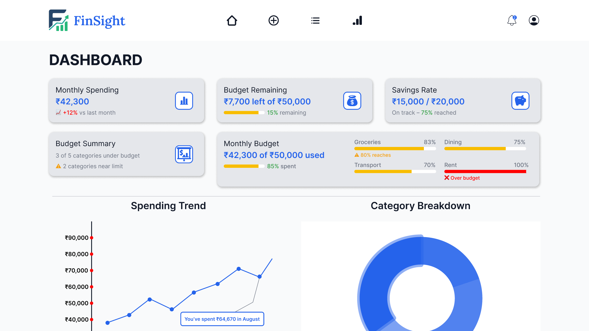
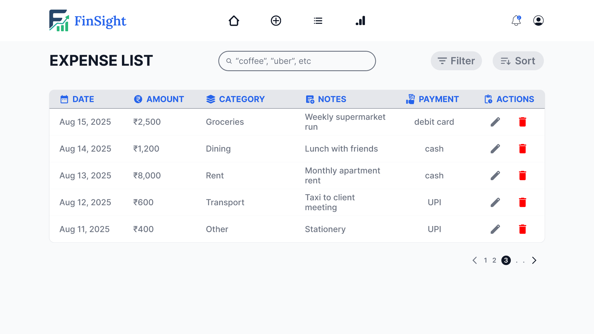
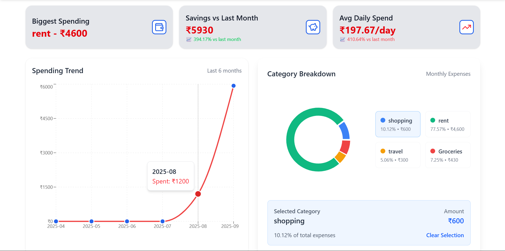
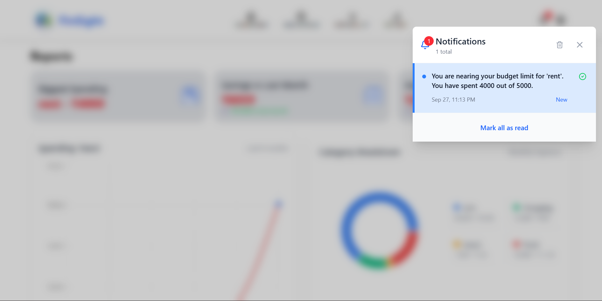

# 🏦 FinSight - AI-Powered Expense Tracker

<div align="center">
  
  
  **Smart Personal Finance Management with AI Insights**
  
  [](https://finsight-et.netlify.app/)
  [](https://reactjs.org/)
  [](https://nodejs.org/)
  [](https://mongodb.com/)
  [](https://ai.google.dev/)
</div>

## 📋 Table of Contents

- [🌟 Features](#-features)
- [🎯 Key Highlights](#-key-highlights)
- [🛠️ Tech Stack](#️-tech-stack)
- [📸 Screenshots](#-screenshots)
- [🚀 Quick Start](#-quick-start)
- [⚙️ Environment Setup](#️-environment-setup)
- [📁 Project Structure](#-project-structure)
- [🤖 AI Features](#-ai-features)
- [🔐 Security Features](#-security-features)
- [📱 Responsive Design](#-responsive-design)
- [🧪 Testing](#-testing)
- [🚀 Deployment](#-deployment)
- [🤝 Contributing](#-contributing)
- [📄 License](#-license)

## 🌟 Features

### 💰 Smart Expense Management

- **📊 Intelligent Transaction Tracking** - Add, edit, and categorize income/expenses
- **🔄 Recurring Transactions** - Set up automatic recurring payments and income
- **📱 Receipt OCR Processing** - Upload receipts and extract transaction data automatically using AI
- **💳 Multiple Payment Methods** - Support for Cash, UPI, and Card payments
- **📅 Date-wise Organization** - Track expenses with precise date management

### 🧠 AI-Powered Intelligence

- **🤖 Google Gemini Integration** - Advanced AI for receipt processing and insights
- **📈 Smart Categorization** - Automatic expense categorization based on transaction notes
- **💡 Personalized Financial Tips** - AI-generated budgeting advice and spending insights
- **⚠️ Intelligent Alerts** - Proactive notifications for budget limits and spending patterns

### 📊 Comprehensive Analytics

- **📈 Interactive Charts** - Visual representation of spending trends and patterns
- **💹 Income vs Expense Analysis** - Compare income and expenses over time
- **🥧 Category Breakdown** - Detailed breakdown of expenses by categories
- **📋 Monthly Reports** - Comprehensive financial reports with AI insights

### 🎯 Budget Management

- **💰 Smart Budgeting** - Set monthly and category-wise budget limits
- **📊 Real-time Tracking** - Monitor budget usage in real-time
- **🚨 Budget Alerts** - Get notified when approaching or exceeding budget limits
- **📈 Budget Analytics** - Track budget performance over time

### 🔔 Real-time Notifications

- **⚡ Live Updates** - Socket.io powered real-time notifications
- **⚙️ Customizable Alerts** - Configure notification preferences
- **📱 Multi-channel Notifications** - In-app and system notifications
- **🕐 Smart Timing** - Scheduled daily reminders and budget alerts

## 🎯 Key Highlights

- 🎨 **Modern UI/UX** - Clean, intuitive interface built with React and TailwindCSS
- 📱 **Fully Responsive** - Works seamlessly on desktop, tablet, and mobile devices
- 🔒 **Secure Authentication** - JWT-based authentication with bcrypt password hashing
- ⚡ **Real-time Updates** - Socket.io integration for instant notifications
- 🤖 **AI-First Approach** - Google Gemini AI for receipt processing and financial insights
- 📊 **Rich Analytics** - Interactive charts and comprehensive reporting
- 🔄 **Recurring Transactions** - Automated handling of regular income and expenses
- 💾 **Data Persistence** - Robust MongoDB database with optimized queries

## 🛠️ Tech Stack

### Frontend

- **⚛️ React 19** - Modern UI library with latest features
- **🎨 TailwindCSS 4** - Utility-first CSS framework
- **📊 Recharts** - Interactive chart library for data visualization
- **🎭 Framer Motion** - Smooth animations and transitions
- **🔄 Redux Toolkit** - State management with RTK Query
- **🛣️ React Router Dom** - Client-side routing
- **🔌 Socket.io Client** - Real-time communication
- **📡 Axios** - HTTP client for API calls
- **🔧 Vite** - Fast build tool and development server

### Backend

- **🟢 Node.js** - JavaScript runtime environment
- **⚡ Express.js** - Fast, unopinionated web framework
- **🍃 MongoDB** - NoSQL database with Mongoose ODM
- **🔐 JWT** - Secure authentication tokens
- **🛡️ bcryptjs** - Password hashing and security
- **🤖 Google Generative AI** - Gemini AI for intelligent features
- **📁 Multer** - File upload handling for receipts
- **🔔 Socket.io** - Real-time bidirectional communication
- **⏰ Node-cron** - Scheduled task management
- **🌐 CORS** - Cross-origin resource sharing

### AI & Analytics

- **🧠 Google Gemini 2.5 Flash** - Advanced AI model for receipt processing
- **📊 Smart Categorization** - AI-powered expense categorization
- **💡 Financial Insights** - Personalized budgeting recommendations
- **🔍 OCR Processing** - Intelligent receipt data extraction

## 📸 Screenshots

<div align="center">
  
  
  
  
</div>

## 🚀 Quick Start

### Prerequisites

Before you begin, ensure you have the following installed:

- **Node.js** (v18 or higher)
- **npm** or **yarn**
- **MongoDB** (local installation or MongoDB Atlas)
- **Git**

### 🔧 Installation

1. **Clone the repository**

   ```bash
   git clone https://github.com/olapuajay/FinSight_AI_Expense_Tracker.git
   cd FinSight_AI_Expense_Tracker
   ```

2. **Install server dependencies**

   ```bash
   cd server
   npm install
   ```

3. **Install client dependencies**

   ```bash
   cd ../client
   npm install
   ```

4. **Set up environment variables** (See [Environment Setup](#️-environment-setup))

5. **Start the development servers**

   **Terminal 1 - Backend Server:**

   ```bash
   cd server
   npm run dev
   ```

   **Terminal 2 - Frontend Development Server:**

   ```bash
   cd client
   npm run dev
   ```

6. **Access the application**
   - Frontend: `http://localhost:5173`
   - Backend: `http://localhost:8001`

## ⚙️ Environment Setup

### Server Environment Variables

Create a `.env` file in the `server` directory:

```env
# Database Configuration
MONGO_URI=your_mongodb_connection_string

# JWT Configuration
JWT_SECRET=your_super_secure_jwt_secret_key

# Google Gemini AI
GEMINI_API_KEY=your_google_gemini_api_key

# Server Configuration
PORT=8001
NODE_ENV=development

# CORS Configuration (for production)
CLIENT_URL=https://finsight-et.netlify.app
```

### Client Environment Variables

Create a `.env` file in the `client` directory:

```env
# API Configuration
VITE_API_URL=http://localhost:8001/api
VITE_SERVER_URL=http://localhost:8001

# For production
# VITE_API_URL=https://your-backend-url.com/api
# VITE_SERVER_URL=https://your-backend-url.com
```

### 🔑 Getting API Keys

1. **MongoDB Atlas** (Free):

   - Visit [MongoDB Atlas](https://www.mongodb.com/atlas)
   - Create a free cluster
   - Get your connection string

2. **Google Gemini API** (Free tier available):
   - Go to [Google AI Studio](https://makersuite.google.com/app/apikey)
   - Create a new API key
   - Copy the key to your environment variables

## 📁 Project Structure

```
FinSight_AI_Expense_Tracker/
├── client/                          # Frontend React Application
│   ├── public/                      # Static assets
│   │   ├── logo.png                # App logo
│   │   ├── preview.png             # Social media preview
│   │   └── _redirects              # Netlify redirects
│   ├── src/
│   │   ├── api/                    # API service functions
│   │   │   ├── auth.js             # Authentication APIs
│   │   │   ├── transaction.js      # Transaction APIs
│   │   │   ├── charts.js           # Chart data APIs
│   │   │   └── reports.js          # Report APIs
│   │   ├── assets/                 # Images and static files
│   │   ├── components/             # Reusable React components
│   │   │   ├── charts/             # Chart components
│   │   │   ├── dashboard/          # Dashboard specific components
│   │   │   ├── landing/            # Landing page components
│   │   │   ├── reports/            # Report components
│   │   │   └── settings/           # Settings components
│   │   ├── pages/                  # Page components
│   │   │   ├── Dashboard.jsx       # Main dashboard
│   │   │   ├── ExpenseList.jsx     # Transaction management
│   │   │   ├── Reports.jsx         # Analytics and reports
│   │   │   └── ProfileSettings.jsx # User settings
│   │   ├── redux/                  # State management
│   │   │   ├── store.js            # Redux store configuration
│   │   │   └── slices/             # Redux slices
│   │   ├── App.jsx                 # Main app component
│   │   └── main.jsx                # React entry point
│   ├── package.json                # Client dependencies
│   └── vite.config.js              # Vite configuration
├── server/                         # Backend Node.js Application
│   ├── config/                     # Configuration files
│   │   ├── db.js                   # Database connection
│   │   └── env.js                  # Environment setup
│   ├── controllers/                # Route controllers
│   │   ├── authController.js       # Authentication logic
│   │   ├── transactionController.js # Transaction management
│   │   ├── budgetController.js     # Budget management
│   │   └── reportController.js     # Report generation
│   ├── models/                     # MongoDB models
│   │   ├── User.js                 # User schema
│   │   ├── Transaction.js          # Transaction schema
│   │   ├── Budget.js               # Budget schema
│   │   └── Notification.js         # Notification schema
│   ├── routes/                     # API routes
│   ├── services/                   # Business logic services
│   │   ├── gemini.js               # AI service integration
│   │   ├── alertService.js         # Notification service
│   │   └── notificationService.js  # Real-time notifications
│   ├── middlewares/                # Custom middlewares
│   │   ├── authMiddleware.js       # JWT authentication
│   │   └── uploadMiddleware.js     # File upload handling
│   ├── cron/                       # Scheduled tasks
│   │   ├── alertCron.js            # Budget alert scheduler
│   │   └── recurringTransaction.js # Recurring transaction processor
│   ├── utils/                      # Utility functions
│   ├── uploads/                    # Uploaded files storage
│   ├── package.json                # Server dependencies
│   └── server.js                   # Express server entry point
└── README.md                       # Project documentation
```

## 🤖 AI Features

### 📸 Receipt OCR Processing

- **Smart Data Extraction**: Upload receipts and automatically extract transaction details
- **Multi-format Support**: Supports JPEG, PNG, WebP image formats
- **Intelligent Categorization**: AI automatically categorizes transactions based on receipt content
- **Data Validation**: Smart validation and error handling for extracted data

### 💡 Financial Insights

- **Personalized Tips**: AI-generated budgeting advice based on spending patterns
- **Spending Analysis**: Intelligent analysis of financial behavior
- **Budget Recommendations**: Smart suggestions for budget optimization
- **Trend Predictions**: AI-powered spending trend analysis

### 🏷️ Auto-Categorization

- **Smart Category Detection**: Automatic expense categorization from transaction notes
- **Learning Algorithm**: AI learns from user patterns to improve accuracy
- **Fallback Options**: Manual override available for AI suggestions

## 🔐 Security Features

- **🔒 JWT Authentication**: Secure token-based authentication system
- **🛡️ Password Hashing**: bcrypt encryption for password security
- **🔐 Protected Routes**: Frontend and backend route protection
- **🌐 CORS Configuration**: Proper cross-origin resource sharing setup
- **✅ Input Validation**: Comprehensive data validation and sanitization
- **🚫 Error Handling**: Secure error messages without sensitive information exposure

## 📱 Responsive Design

- **📱 Mobile First**: Optimized for mobile devices
- **💻 Desktop Friendly**: Full-featured desktop experience
- **📊 Adaptive Charts**: Charts that scale beautifully across devices
- **⚡ Fast Loading**: Optimized performance on all screen sizes
- **🎨 Consistent UI**: Uniform design language across all breakpoints

## 🧪 Testing

### Running Tests

```bash
# Frontend tests
cd client
npm run test

# Backend tests
cd server
npm run test

# Lint check
npm run lint
```

### Testing Features

- **Unit Tests**: Component and function testing
- **Integration Tests**: API endpoint testing
- **E2E Tests**: End-to-end user flow testing
- **Performance Tests**: Load and performance testing

## 🚀 Deployment

### Frontend Deployment (Netlify)

1. **Build the project**

   ```bash
   cd client
   npm run build
   ```

2. **Deploy to Netlify**
   - Connect your GitHub repository to Netlify
   - Set build command: `npm run build`
   - Set publish directory: `dist`
   - Add environment variables in Netlify dashboard

### Backend Deployment (Railway/Heroku/DigitalOcean)

1. **Prepare for production**

   ```bash
   cd server
   npm run build # if applicable
   ```

2. **Set environment variables**

   - Configure all required environment variables
   - Update CORS settings for production URL

3. **Deploy using your preferred platform**

### Environment Variables for Production

**Frontend (Netlify)**:

```env
VITE_API_URL=https://your-backend-url.com/api
VITE_SERVER_URL=https://your-backend-url.com
```

**Backend**:

```env
MONGO_URI=your_production_mongodb_uri
JWT_SECRET=your_production_jwt_secret
GEMINI_API_KEY=your_gemini_api_key
CLIENT_URL=https://finsight-et.netlify.app
NODE_ENV=production
PORT=8001
```

## 🎯 Usage Guide

### 👤 Getting Started

1. **Sign Up**: Create your account with email and secure password
2. **Profile Setup**: Configure your currency and profile information
3. **First Transaction**: Add your first income or expense transaction

### 💰 Managing Transactions

1. **Manual Entry**: Use the "Add Transaction" button to manually enter transactions
2. **Receipt Upload**: Upload receipts for automatic data extraction
3. **Recurring Setup**: Configure recurring income/expenses for automation
4. **Categories**: Organize transactions with smart categorization

### 📊 Budget Planning

1. **Set Budgets**: Define monthly and category-wise budget limits
2. **Track Progress**: Monitor your spending against budget goals
3. **Get Alerts**: Receive notifications when approaching budget limits

### 📈 Analytics & Reports

1. **Dashboard Overview**: Get quick insights on your financial health
2. **Detailed Charts**: Analyze spending trends and patterns
3. **AI Insights**: Receive personalized financial advice
4. **Export Data**: Download reports for external analysis

## 🤝 Contributing

We welcome contributions to FinSight! Here's how you can help:

### 🛠️ Development Setup

1. **Fork the repository**
2. **Create a feature branch**
   ```bash
   git checkout -b feature/amazing-feature
   ```
3. **Make your changes**
4. **Run tests**
   ```bash
   npm run test
   ```
5. **Commit your changes**
   ```bash
   git commit -m 'Add some amazing feature'
   ```
6. **Push to the branch**
   ```bash
   git push origin feature/amazing-feature
   ```
7. **Open a Pull Request**

### 📋 Contribution Guidelines

- Follow the existing code style
- Write clear, descriptive commit messages
- Add tests for new features
- Update documentation as needed
- Ensure all tests pass before submitting

### 🐛 Bug Reports

- Use the GitHub issue tracker
- Provide detailed reproduction steps
- Include screenshots if applicable
- Specify your environment details

### 💡 Feature Requests

- Check existing issues first
- Provide clear use cases
- Explain the expected behavior
- Consider implementation complexity

## 📊 Performance

- **⚡ Fast Loading**: Optimized bundle size with code splitting
- **📱 Mobile Optimized**: Smooth performance on mobile devices
- **🔄 Efficient State Management**: Redux for optimal state updates
- **📊 Lazy Loading**: Components and routes loaded on demand
- **🎯 SEO Optimized**: Meta tags and social media integration

## 🌟 Roadmap

- [ ] **📱 Mobile App**: React Native mobile application
- [ ] **🔗 Bank Integration**: Direct bank account synchronization
- [ ] **📄 Receipt Management**: Advanced receipt storage and search
- [ ] **👥 Multi-user Support**: Family and business account management
- [ ] **🌍 Multi-currency**: Support for multiple currencies
- [ ] **📊 Advanced Analytics**: More detailed financial insights
- [ ] **🤖 Chatbot**: AI-powered financial assistant
- [ ] **📈 Investment Tracking**: Portfolio management features

## 💬 Support

Need help? Here are your options:

- **📧 Email**: [olapuajay@gmail.com]
- **💬 GitHub Issues**: [Create an issue](https://github.com/olapuajay/FinSight_AI_Expense_Tracker/issues)
- **📖 Documentation**: Check this README and inline code comments
- **🌐 Live Demo**: [https://finsight-et.netlify.app/](https://finsight-et.netlify.app/)

## 📄 License

This project is licensed under the MIT License - see the [LICENSE](LICENSE) file for details.

## 👏 Acknowledgments

- **Google Gemini AI** for intelligent receipt processing
- **React Team** for the amazing frontend framework
- **MongoDB** for reliable data storage
- **TailwindCSS** for beautiful, responsive design
- **Socket.io** for real-time communication
- **Recharts** for interactive data visualization

---

<div align="center">
  <strong>Built with ❤️ by [Ajay]</strong>
  
  ⭐ Star this repo if you find it helpful!
  
  [Live Demo](https://finsight-et.netlify.app/) • [Report Bug](https://github.com/olapuajay/FinSight_AI_Expense_Tracker/issues) • [Request Feature](https://github.com/olapuajay/FinSight_AI_Expense_Tracker/issues)
</div>
